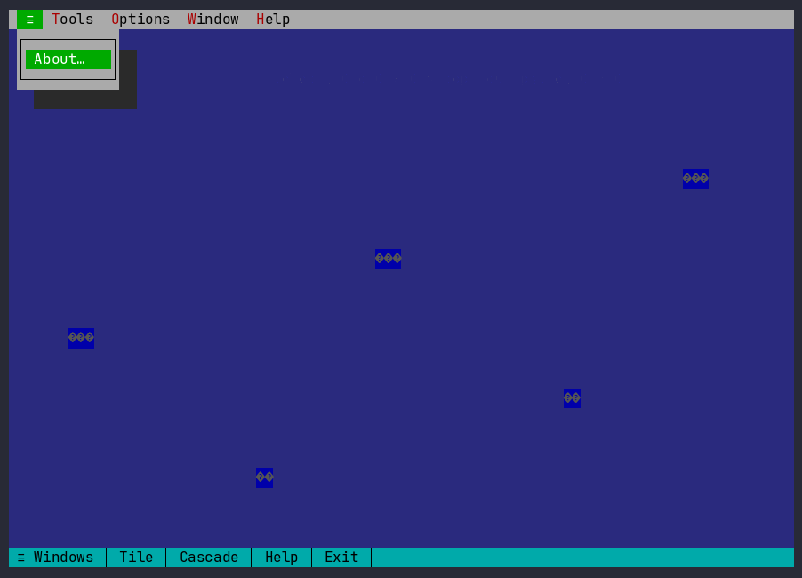
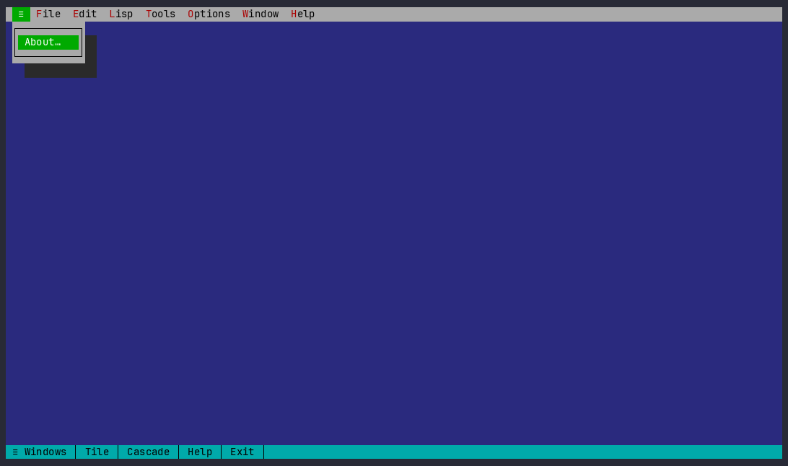

es # revision — a CLOS-native text-mode UI framework for Common Lisp

`revision` is a clean-break re-architecture of a Turbo-Vision-style TUI framework's
*dispatch and construction* layers: if you diverged from classic Turbo Vision and
rebuilt on top of CLOS, this is what the framework looks like.

It's a **reusable toolkit**, not an application.  revision owns the foundation
([`../base/`](../base): terminal driver, screen/cell buffer, geometry, the
Unicode/grapheme engine, the `outline-node` data structure) and layers the new
plumbing — state, events, commands, layout, theming, persistence — on top, plus a
widget set and a **desktop shell** with a plugin registry.  The Lisp IDE that
exercises it, **[revl](https://github.com/lispnik/revl)**, is a *separate
application*; so are the [revision-term](https://github.com/lispnik/revision-term)
terminal-emulator widget and the [revision-sixel](https://github.com/lispnik/revision-sixel)
image view.

```lisp
(asdf:load-system "revision")
(revision:run-desktop)     ; a bare shell: menu bar (Window / Options / Help) + status bar + hosted windows
;; or host a single widget full-screen:
(revision:run)             ; the kitchen-sink demo; also run-editor, run-html
```

The desktop is a real window manager — a Turbo-Vision-style **menu bar**, **status
bar**, and a background hosting **movable / resizable / overlapping windows** — with a
**plugin registry** (`*window-builders*` for windows, `*extra-menus*` for menus) that
an application extends.  On the **bare toolkit** it's a generic shell: a `Tools` menu
contributed through the registry opens the widgets (here the Lisp editor, with syntax
highlighting + auto-indent), `Options ▸ Colour theme` recolours the whole desktop live,
and the `Window` menu manages the windows:



**[revl](https://github.com/lispnik/revl)** layers the SLIME-class IDE on top — the
REPL + SLDB debugger, the object inspector, the git project tree, the browsers, and
the Inspect / Tools / Lisp / Navigate menus (tracing, profiling, paredit, source
navigation, a live HyperSpec lookup):



## What's different from classic Turbo Vision

| Concern | Classic Turbo Vision | revision |
| --- | --- | --- |
| Redraw | call `draw-view` after mutating | a **reactive metaclass** invalidates the screen on any slot write |
| Events | integer `+ev-*+` type tags, `cond` on type | **CLOS event classes** dispatched by multimethods `(view × event)` |
| Commands | 138 integer `+cm-*+` constants + a central dispatch `cond` | **named command objects** resolved through layered **keymaps** → `perform` |
| Layout | hand-computed `TRect` bounds | a **box-model DSL** (`stack`/`row` with `:fill`/integer sizes) via the `ui` macro |
| Colours | byte palettes walked up the owner chain | **named roles** resolved through `*theme*` |
| Modal result | boolean `Valid` + error flags | dialogs that **return values**; validation via **conditions/restarts** |
| Persistence | `TStream` `read`/`write` methods | **MOP-based** `serialize`/`deserialize` with a `:transient` slot option |
| Background work | — | a **worker→UI bridge** (`run-on-ui`/`drain-ui-callbacks`): only the UI thread touches the screen |

## Kernel layers (load order)

- **`kernel.lisp`** — the `reactive-class` metaclass (`(setf slot-value-using-class) :after` → `invalidate`); the `view` base class; geometry helpers; the event class hierarchy and `translate` (a raw INPUT-EVENT → a CLOS revision event); `keymap`/`defkeymap`/`keymap-lookup`; `command`/`define-command`/`perform`; drawing helpers; `*theme*`/`role`; the `container` protocol (focus routing, Tab cycling, event bubbling).
- **`runtime.lisp`** — the `persistent-class` metaclass + `:transient` slots, `serialize`/`deserialize`/`save-object`/`load-object`, the `session` object, and the worker→UI bridge.
- **`outline.lisp`** — the `outline` tree view (reuses the base `outline-node`, supports lazy children).
- **`widgets.lisp`** — `window`, `button`, `static-text`, `input-line`, `list-box`.
- **`scrollback.lisp`** — an append-only, auto-following, scrollable transcript view.
- **`layout.lisp`** — the `stack`/`row` layout containers and the compile-time-checked `ui` construction macro.
- **`modal.lisp`** — value-returning `dialog`s and `exec-view` (the modal loop), with conditions/restarts for validation.
- **`syntax.lisp`** — pluggable colorizers for the editor (`lisp-colorize`).
- **`editor.lisp` / `table.lisp` / `html.lisp`** — the text editor (with per-instance indent/completion/paren/eval hook overrides), the columnar table view, and the HTML view.
- **`desktop.lisp`** — the menu bar / status bar / window-manager shell and the `*window-builders*` + `*extra-menus*` plugin registry an application extends.
- **`reference.lisp` / `reflection.lisp`** — the keybinding reference (`KEYBINDINGS.md`) and the public-API reference (`API.md`), both generated from the live definitions.

## Building views — the `ui` macro

`ui` builds a view tree from a nested spec, checked at macroexpansion.  A window
holds a layout container — **`stack`** (splits vertically) or **`row`** (splits
horizontally) — whose children are **sized cells** written `(SIZE child)`:

- an **integer** is a *fixed* size in terminal cells — **rows** tall in a `stack`,
  **columns** wide in a `row`;
- **`:fill`** takes an equal share of whatever is left after the fixed cells.
  Several `:fill` cells split the remainder evenly (`floor(slack / n)`), so two
  `:fill`s around a fixed cell centre it, and one `:fill` soaks up the rest.

Containers nest freely (a `row` inside a `stack` cell, and so on):

```lisp
(ui (window (:title " Demo " :keymap *global-keys*)
      (stack                                                    ; vertical → numbers are ROWS
        (1     (row (9 (static-text :role :label :text " Filter: "))   ; 9 columns wide
                    (:fill (input-line :name 'find :on-change #'my-handler))))  ; fills the rest
        (:fill (outline :name 'tree :roots (demo-roots) :keymap *outline-keys*)); fills the height
        (1     (row (16 (button :label "Collapse all" :command 'collapse-all))  ; 16 columns
                    (8  (button :label "Quit"         :command 'quit))          ; 8 columns
                    (:fill (static-text :name 'echo :role :status :text "")))))))
```

Behaviour is data: keys map to named commands, commands are methods on the
command name, and views react to state changes automatically.

```lisp
(defkeymap *outline-keys* (*global-keys*)
  (:up cursor-up) (:down cursor-down) (:enter activate) (:right activate) (:left collapse))

(define-command cursor-down (v e) (ov-move v 1))
```

## Runnable entry points

revision ships a few standalone entry points; the Lisp-IDE windows (REPL, debugger,
inspector, project tree, browsers) live in **[revl](https://github.com/lispnik/revl)**,
not here.

| Entry point | What it is |
| --- | --- |
| `run-desktop` | the desktop shell — menu bar + status bar hosting movable/resizable/overlapping windows; an application populates it via `*window-builders*` / `*extra-menus*` |
| `run` | the kitchen-sink demo (outline + list + input + buttons + a `go-to-line` modal + session persistence + a background clock through the worker→UI bridge) |
| `run-editor` | the text editor — vector-of-lines model, selection, clipboard, undo/redo, file I/O, incremental find + regex replace, opt-in soft word-wrap (`C-w`), and per-instance syntax-colour / indent / completion / paren hooks |
| `run-html` | the HTML view — a tokenizer + box layout with styled runs, link navigation, in-document anchors, and find-in-page (`/`, `<`/`>`) |
| `run-view` | host any single view you build full-screen (see *Hello, world* in the repo-root README) |

## Status & non-goals

revision is a compact toolkit: it demonstrates the architecture end-to-end, not a
hardened release.  **Mouse** is supported — clicks hit-test the view tree to
focus/select/press (menus, rows, buttons, links, caret placement) and the wheel
scrolls the view under the pointer.  The desktop is a real window manager:
**movable / resizable / overlapping windows** (drag the title to move, the ◢ grip
to resize, `[✕]` to close; the Window menu tiles/cascades).  Scrollable windows
draw a **scrollbar** on the right frame edge (click the arrows/track or drag the
thumb).  The bottom **status bar** shows clickable, context-sensitive chips —
window actions plus the focused widget's own `status-hints`.  Checkbox and radio
**cluster** controls are available (Space or click toggles; see the Options
window).  Standard **dialogs** are there too: a file picker and change-dir (File
menu) and a live colour customiser that edits `*theme*` with instant preview.
**F1** (or the Help menu) opens context-sensitive help for the focused window,
rendered with the HTML view and cross-linked between topics.  The editor also has
incremental **find**, **replace-all with optional regex** (Find/Next/Replace chips),
**auto-indent**, and **mouse drag-select**.
The menu bar has **Alt-hotkeys** (the highlighted letter) and global **CUA
accelerators** (text-mode / IBM SAA style): `F1` Help, `F2` Save, `F3` Open,
`Alt-X` Exit, `F5`/`F6` Zoom/Next, `Alt-F3` Close, and the
clipboard on `Shift+Del`/`Ctrl+Ins`/`Shift+Ins` (`Ctrl-X/C/V` also work); disabled
items are dimmed.  A **table viewer** (columns + fixed header + scrollbar) is
available, and input fields support **validators** (filter / range / picture) and
**Up/Down history** recall.  Type-to-filter inputs rank results with **fzf-style
fuzzy matching**, and menus support **nested submenus**.  The **whole desktop
persists** — the open windows (kind, position, size, Z-order; editor filenames) are
saved to `~/.revision-desktop` on exit and restored on launch (`dt-save-layout` /
`dt-load-layout`).  revision covers the full Turbo-Vision interaction model end to end.
